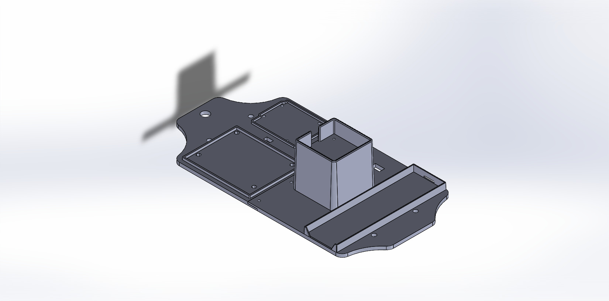
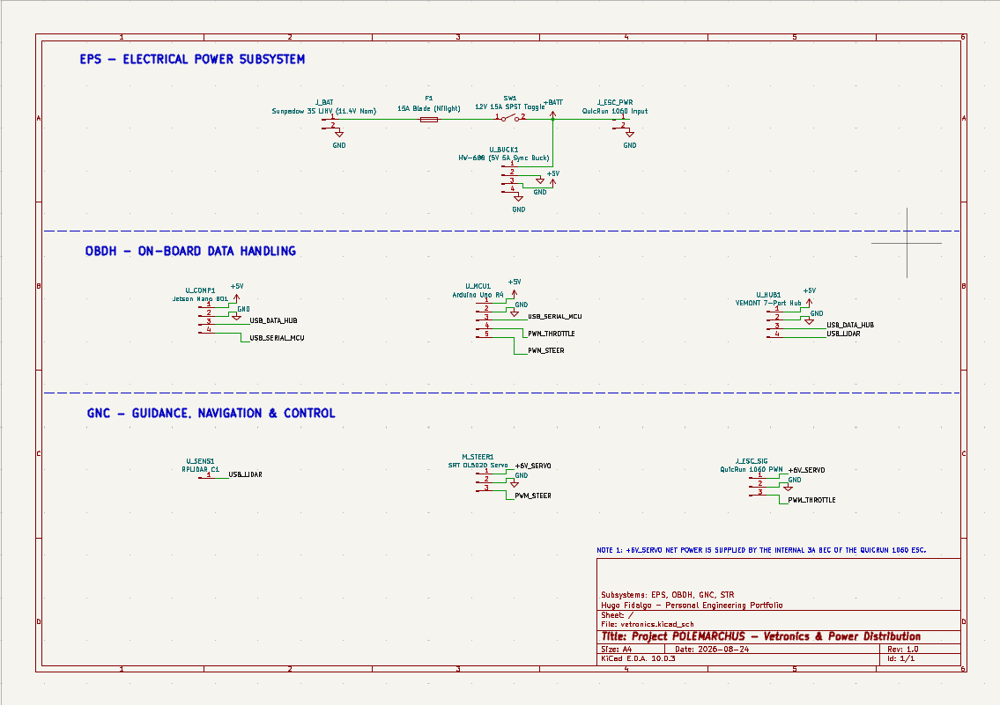
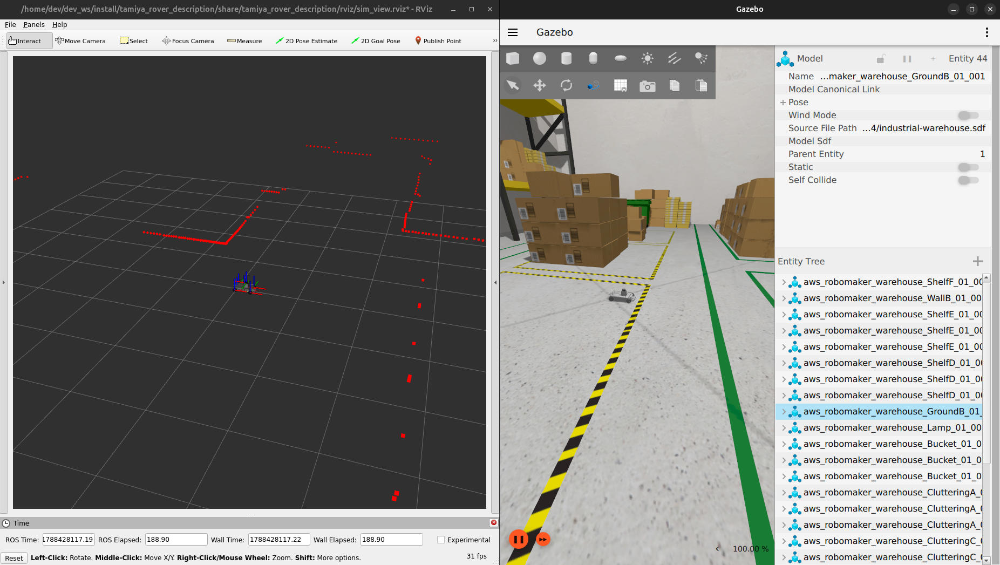

<div align="center">
  
  # [Project Logo]
  **A 1:10 scale ROS 2 Teleoperated Perception Ground Vehicle**
  
  [](https://docs.ros.org/en/humble/index.html)
  [](https://releases.ubuntu.com/22.04/)
  [](https://isocpp.org/)
  
</div>

## System Overview
Polemarchus is a 1:10 scale robotics platform based on the Tamiya TT-02 chassis (A popular introductory Kit Car). The current iteration features a fully verified ROS 2 teleoperation and LiDAR Perception stack in real time over WI-FI. In this repository you will find all the files used for this initial prototype (Firmware; Hardware: Mechanical, Electronics; ROS 2 Software; Docker). 

<div align="center">

  []()

  *Click the image above to view the physical system demo.*

</div>

- [System Overview](#system-overview)
- [Mechanical Architecture](#mechanical-architecture)
- [Electrical Architecture](#electrical-architecture)
- [Software Architecture](#software-architecture)
- [Quick Start & Simulation](#quick-start--simulation)
- [Future Roadmap](#future-roadmap)

## Mechanical Architecture
The physical platform utilizes an RC racing chassis, with a 3D printed custom designed deck that holds all electronic components and wiring.

* **Chassis:** Tamiya TT-02R
* **Vetronics Deck [SolidWorks Files]:** `hardware/mechanical/solidworks`

<div align="center">

  

</div>

* **Robot Description:** Full URDF/Xacro representation for simulation purposes. `src/tamiya_rover_description/description`

## Electrical Architecture
This rover utilizes an On-Board computer, running a custom docker container, which communicates over serial with the MicroController Unit.

* **OBC:** Jetson Nano DevKit (2019)
* **MCU:** Arduino Uno R4 WIFI

Below you can find a simplified electronics diagram of the rover's EPS, OBDH and GNC subsystems. It can also be found here: `hardware/schematics/vetronics/vetronics.kicad_sch`

<div align="center">

  

</div>

There is also a bill of materials of the components used. `hardware/bom/ROS-2_Tamiya_TT-02R_[BOM].xlsx`

The Arduino Uno R4 controls the vehicle's actuators. Developed in C++ via PlatformIO.

* **Serial Ingestion:** Continuously reads and parses comma-separated strings from the Jetson Nano (OBC).

* **PWM translation:** Converts digital commands into microsecond PWM signals to control the Electronic Speed Controller (ESC) and steering servo.

* **Embedded Failsafes:** Integrates a watchdog timer to halt the car in case no commands were sent for more than 500ms.

All logic is documented inline within: `firmware/mcu_firmware/src/main.cpp`

## Software Architecture
The software stack is built entirely on ROS 2 Humble.

* **Control:** Custom ROS 2 Node that subscribes to the `/cmd_vel` topic and sends the correct PWM Signal in microseconds to the MCU. `src/rover_mcu_bridge/src/mcu_bridge_node.cpp`

* **Gazebo Simulation:** Physics simulation using Gazebo which bridges the ROS 2 topics through `ros_gz_bridge`. All programs are initialized by an automated sim.launch.py script. `src/tamiya_rover_description/launch/sim.launch.py`

* **Perception:** Native integration of the RPLIDAR C1 node publishing LaserScan data to RViz.

## Quick Start & Simulation

**Prerequisites:**

* **Linux/macOS:** Ensure Docker and Docker Compose are installed.
* **Windows:** You must have Docker Desktop installed with the WSL2 backend enabled. All .sh scripts must be executed from within a WSL2 terminal (e.g, Ubuntu 22.04 on WSL) to support graphical forwarding for RViz and Gazebo.

**Simulation Setup:**

**Clone the repository:**
```
git clone https://github.com/hugo-fidalgo/tamiya-ros2-autonomous.git
cd tamiya-ros2-autonomous
```

**Build and launch the containerized environment:**
```
chmod +x run_desktop.sh
./run_desktop.sh

cd ~/dev_ws
colcon build --symlink-install
source install/setup.bash
```

**Launch the simulation:**

This script should launch both RViz and Gazebo.

```
ros2 launch tamiya_rover_description sim.launch.py
```
<div align="center">



</div>

**Control the  simulated car:**
Open another terminal, here you will send `/cmd_vel` commands with your keyboard.

```
docker exec -it sim-environment bash
ros2 run teleop_twist_keyboard teleop_twist_keyboard
```

**Physical Car Setup:**

Both the physical car and your laptop must be connected to the same Wi-Fi network.

Connect to the car using ssh.

You should have two terminals, one for the car (connected over ssh) and one for the laptop.

**On the car's terminal:**

**Clone the repository:**
```
git clone https://github.com/hugo-fidalgo/tamiya-ros2-autonomous.git
cd tamiya-ros2-autonomous
```

**Build and launch the containerized environment:**
```
chmod +x run_jetson.sh
./run_jetson.sh

cd ~/robot_ws
colcon build --symlink-install
source install/setup.bash
```

**Launch the hardware script:**
```
ros2 launch tamiya_rover_description hardware.launch.py
```

**On the laptop's terminal:**

**Clone the repository:**
```
git clone https://github.com/hugo-fidalgo/tamiya-ros2-autonomous.git
cd tamiya-ros2-autonomous
```

**Build and launch the containerized environment:**
```
chmod +x run_desktop.sh
./run_desktop.sh

cd ~/dev_ws
colcon build --symlink-install
source install/setup.bash
```

**Control the  physical car:**
Open another terminal, here you will send `/cmd_vel` commands with your keyboard.

```
docker exec -it sim-environment bash
ros2 run teleop_twist_keyboard teleop_twist_keyboard
```

**Visualize the car perception sensors:**
Open another terminal, here you will initialize RViz to visualize the car LaserScan.

```
docker exec -it sim-environment bash
rviz2 -d src/tamiya_rover_description/rviz/robot_view.rviz
```

## Future Roadmap

Here I lay out fixes and future implementations needed for this project to reach the goal of becoming fully autonomous.

**Fix:**
* **Vetronics Deck Redesign:** The Vetronics Deck must be redesigned to accommodate a camera and possibly a depth camera, also a specific physical layer for wiring and electrical logic should be added so it's easier to assemble and debug the car.

**Implementations:**
* **Cameras:** Implement both a camera and a depth camera to the car.
* **SLAM:** Implement slam_toolbox (ROS 2).   
* **Navigation:** Implement ROS 2 NAV 2.
